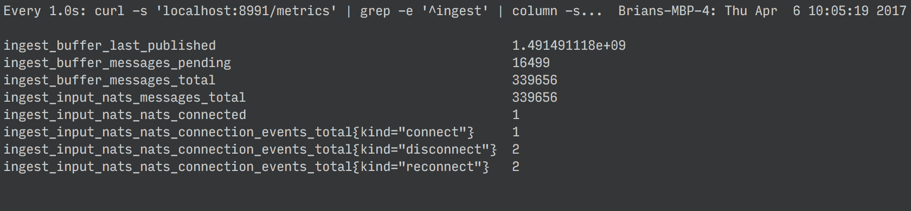

# `promtop`

a quick and dirty `top` for prometheus services

## Usage

    promtop.sh localhost/metrics your_metric_or_prefix
    
## How Rough Is This?

It's really really rough. It won't even detect errors. Use at your own risk, but it's not gonna launch the nukes or anything.
